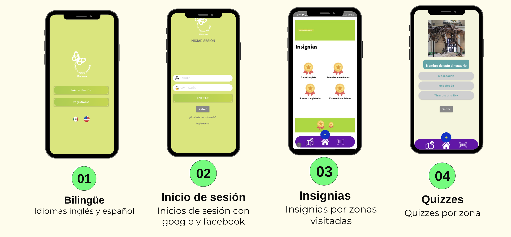
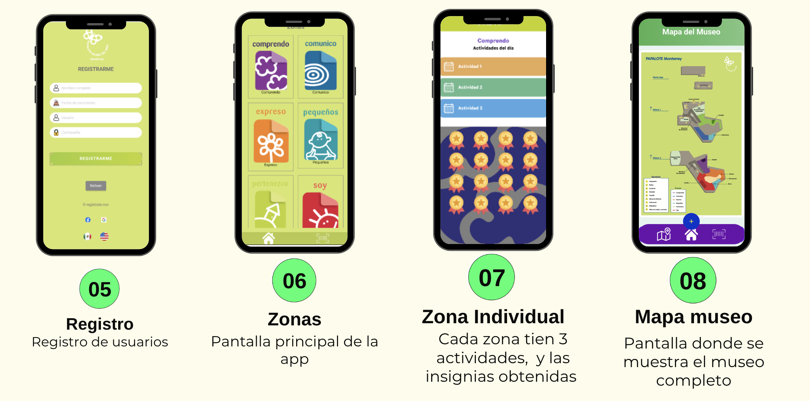

## Developed an Android app using Kotlin and Jetpack Compose to enhance the user experience in a museum environment and a PostgreSQL Database

# Increased user engagement by 30%, as tracked through app usage analytics, by enabling users to interact with various museum zones through QR codes and exercises
# Enabled users to register visited zones and complete exercises, storing their data in a PostgreSQL database for personalized experiences

## App Screenshots

