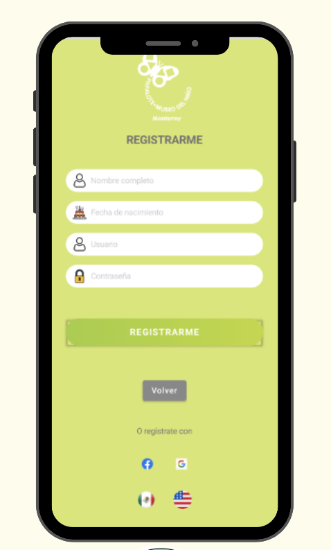
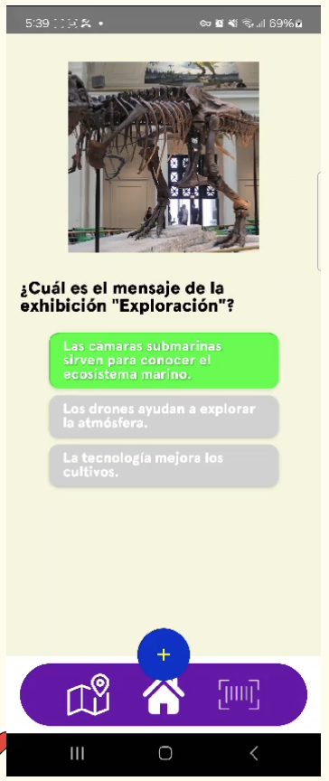

📱 Papalote Museum Interactive App

🏛️ About the Project

This Android application was developed using Kotlin and Jetpack Compose to enhance the visitor experience at the Papalote Museum. The app provides interactive tools that allow users to explore the museum in a more engaging way while also providing valuable insights for museum administrators.

The project includes a REST API and a PostgreSQL database, enabling seamless data management and analysis.

🎯 Key Features

🔍 QR Code Scanning
Visitors can scan QR codes placed throughout the museum to access detailed information about exhibits, artifacts, and attractions.
Museums can customize the information provided through an administrator panel.

📊 Interactive Surveys & Visitor Engagement
We designed customized surveys to make museum visits more interactive.
Visitors can answer fun and educational questions based on their journey.
Responses help the museum improve visitor engagement and educational strategies.

🎟️ User Analytics for Administrators
Museum administrators receive valuable insights about visitor behavior, including:

Time spent in the museum
Most visited areas
QR codes scanned
Survey participation & scores
Visitor comments & feedback
Email collection for future engagement & marketing
This data helps the museum optimize exhibit layouts, enhance visitor experiences, and tailor promotional strategies.

🛠️ Tech Stack
Frontend (Mobile App)
Kotlin – Core programming language
Jetpack Compose – Modern UI toolkit for Android
CameraX – QR Code scanning functionality
Backend
REST API – Developed to manage survey data, QR code content, and visitor analytics
PostgreSQL – Relational database to store visitor interactions and administrator insights
Spring Boot – Framework for building scalable backend services

🚀 Future Improvements

📍 Interactive Map: Help users navigate the museum with an interactive map.

🔔 Push Notifications: Notify visitors about events, exhibits, and promotions.

🌍 Multilingual Support: Offer content in multiple languages for international visitors.

## App Screenshots

